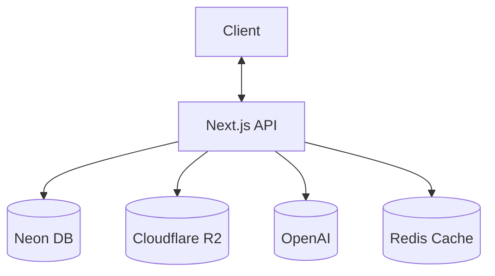
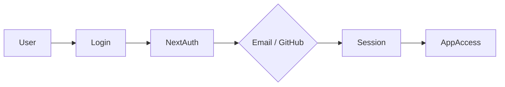
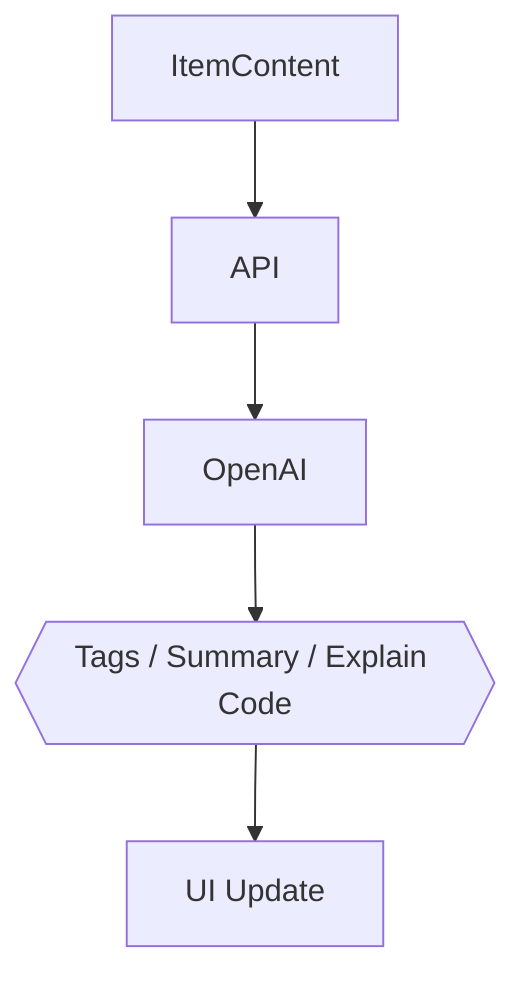

# DeVault — Project Overview

🗄️ **Centralized Developer Knowledge Hub** for code snippets, AI prompts, docs, commands, and more.

> Store Smarter. Build Faster.

---

## 📌 Problem / Core Idea

Developers keep their essentials scattered across too many places:

- Code snippets in VS Code or Notion
- AI prompts buried in chat history
- Context files scattered across projects
- Useful links in browser bookmarks
- Docs in random folders
- Terminal commands in `.txt` files or bash history
- Project templates in GitHub gists

This creates **context switching**, **lost knowledge**, and **inconsistent workflows**.

➡️ **DevVault provides one searchable, AI-enhanced hub for all dev knowledge and resources.**

---

## 🧑‍💻 Target Users

| Persona | Needs |
|---|---|
| 👨‍💻 Everyday Developer | Quick access to snippets, commands, links |
| 🤖 AI-First Developer | Store prompts, workflows, contexts |
| 🎓 Content Creator / Educator | Save course notes, reusable code |
| 🏗️ Full-Stack Builder | Patterns, boilerplates, API references |

---

## ✨ Core Features

### A) Items & Item Types

Every item belongs to one of the following built-in types:

| Type | Icon |
|---|---|
| Snippet | 📄 |
| Prompt | 💬 |
| Note | 📝 |
| Command | ⌘ |
| File | 📁 |
| Image | 🖼️ |
| URL | 🔗 |

Custom item types are available on the **Pro** plan.

### B) Collections

Group items together — mixed item types are allowed within a single collection.

Examples: *React Patterns*, *Context Files*, *Python Snippets*

### C) Search

Full-text search across:

- Content
- Tags
- Titles
- Types

### D) Authentication

- Email + Password
- GitHub OAuth

### E) Additional Features

- ⭐ Favorites & pinned items
- 🕓 Recently used
- 📥 Import from files
- ✍️ Markdown editor for text items
- 📤 File uploads (images, docs, templates)
- 📦 Export (JSON / ZIP)
- 🌙 Dark mode (default)

### F) AI Superpowers

- Auto-tagging
- AI summaries
- Explain Code
- Prompt optimization

> ⚠️ **Note:** The original spec listed "OpenAI gpt-5-nano" as the AI provider. Double-check this model name against OpenAI's current lineup before locking in the tech stack — it may have been a placeholder or since renamed.

---

## 🗄️ Data Model (Prisma Draft)

> Starting point — expect this to evolve as features are built out.

```prisma
model User {
  id                   String       @id @default(cuid())
  email                String       @unique
  password             String?
  isPro                Boolean      @default(false)
  stripeCustomerId     String?
  stripeSubscriptionId String?

  items                Item[]
  itemTypes            ItemType[]
  collections          Collection[]
  tags                 Tag[]

  createdAt            DateTime     @default(now())
  updatedAt            DateTime     @updatedAt
}

model Item {
  id           String   @id @default(cuid())
  title        String
  contentType  String   // "text" | "file"
  content      String?  // used for text-based types
  fileUrl      String?
  fileName     String?
  fileSize     Int?
  url          String?
  description  String?
  isFavorite   Boolean  @default(false)
  isPinned     Boolean  @default(false)
  language     String?

  userId       String
  user         User        @relation(fields: [userId], references: [id])

  typeId       String
  type         ItemType    @relation(fields: [typeId], references: [id])

  collectionId String?
  collection   Collection? @relation(fields: [collectionId], references: [id])

  tags         ItemTag[]

  createdAt    DateTime @default(now())
  updatedAt    DateTime @updatedAt
}

model ItemType {
  id       String  @id @default(cuid())
  name     String
  icon     String?
  color    String?
  isSystem Boolean @default(false)

  userId   String?
  user     User?   @relation(fields: [userId], references: [id])

  items    Item[]
}

model Collection {
  id          String   @id @default(cuid())
  name        String
  description String?
  isFavorite  Boolean  @default(false)

  userId      String
  user        User     @relation(fields: [userId], references: [id])

  items       Item[]

  createdAt   DateTime @default(now())
  updatedAt   DateTime @updatedAt
}

model Tag {
  id     String    @id @default(cuid())
  name   String
  userId String
  user   User      @relation(fields: [userId], references: [id])

  items  ItemTag[]
}

model ItemTag {
  itemId String
  tagId  String

  item   Item @relation(fields: [itemId], references: [id])
  tag    Tag  @relation(fields: [tagId], references: [id])

  @@id([itemId, tagId])
}
```

**Open questions to resolve before finalizing the schema:**
- Should `Tag` have a `@@unique([name, userId])` constraint to prevent duplicate tags per user?
- Should `ItemType` have a `@@unique([name, userId])` constraint for the same reason?
- Do free-tier limits (50 items / 3 collections) get enforced at the DB layer, app layer, or both?

---

## 🧱 Tech Stack

| Category | Choice |
|---|---|
| Framework | Next.js (React 19) |
| Language | TypeScript |
| Database | Neon PostgreSQL + Prisma ORM |
| Caching | Redis *(optional)* |
| File Storage | Cloudflare R2 |
| CSS / UI | Tailwind CSS v4 + ShadCN |
| Auth | NextAuth v5 (Email + GitHub) |
| AI | OpenAI *(model TBD — see note above)* |
| Deployment | Vercel |
| Monitoring | Sentry *(later)* |

---

## 💰 Monetization

| Plan | Price | Limits | Features |
|---|---|---|---|
| **Free** | $0 | 50 items, 3 collections | Basic search, image uploads, no AI |
| **Pro** | $8/mo or $72/yr | Unlimited | File uploads, custom types, AI features, export |

Stripe handles subscriptions; webhooks keep billing state in sync with the database.

---

## 🎨 UI / UX

- Dark mode first
- Minimal, developer-friendly UI
- Syntax highlighting for code
- Design inspiration: **Notion**, **Linear**, **Raycast**

**Layout**
- Collapsible sidebar with filters & collections
- Main grid/list workspace
- Full-screen item editor

**Responsive**
- Mobile drawer for sidebar
- Touch-optimized icons and buttons

---

## 🔌 API Architecture



---

## 🔐 Auth Flow



---

## 🧠 AI Feature Flow



---

## 🗂️ Development Workflow (For Course)

- One branch per lesson (students can follow along & compare)
- Use **Cursor**, **Claude Code**, or **ChatGPT** for assistance
- Sentry for runtime monitoring & error tracking
- GitHub Actions *(optional, for CI)*

**Branch naming example:**
```bash
git switch -c lesson-01-setup
```

---

## 🧭 Roadmap

### MVP
- [ ] Items CRUD
- [ ] Collections
- [ ] Search
- [ ] Basic tags
- [ ] Free-tier limits

### Pro Phase
- [ ] AI features
- [ ] Custom item types
- [ ] File uploads
- [ ] Export
- [ ] Billing & upgrade flow

### Future Enhancements
- [ ] Shared collections
- [ ] Team / Org plans
- [ ] VS Code extension
- [ ] Browser extension
- [ ] Public API + CLI tool

---

## 📌 Status

**In planning** — ready for environment setup & UI scaffolding.

---

## 🧹 Cleanup Notes (from original draft)

A few things worth flagging as you move forward:

1. **Naming**: original notes referred to the project as "DevStash" in most places but you called it "DevVault" — I've standardized on **DevVault** throughout this doc. Double-check the domain/package name is still available.
2. **AI model name**: "gpt-5-nano" isn't a name I can verify — worth confirming the exact current model string with OpenAI before wiring up API calls.
3. **Redis**: marked optional — worth deciding early whether it's in scope for MVP or Pro phase, since caching strategy affects the API architecture diagram.
4. **Schema gaps**: added a couple of open questions above (tag/type uniqueness, limit enforcement) that will need answers before you run your first migration.

---

## Screenshots

Prefer to the screenshots below as a base for the dashboard UI. It does not have to be exact. Use it as a reference:

- @context/screenshots/dashboard-ui-main.png
- @context/screenshots/dashboard-ui-main-drawer.png


🏗️ **DevVault — Store Smarter. Build Faster.**
